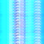
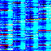
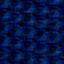
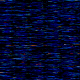
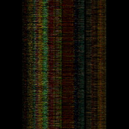

## Quantum Image Encryption Algorithm 

The goal of this project is to generate an image encryption algorithm that
efficiently and effectively encodes digital image information in a secure way. 

The current novel quantum-digital-image representation is known as the "Novel
Enhanced Quantum Representation"
([NEQR](https://link.springer.com/article/10.1007/s11128-013-0567-z_)) of digital images which uses the basis state of a qubit sequence to store the gray-scale value of each pixel in the image. There are a few other methods as well, but they are all incredibly similar and only have distinctions in how they prepare the qubits.

This project aims to generate a quantum algorithm that, for now, requires 

$$\left( \frac{n^2}{2^m}  + 1 \right) \times (m-1)$$ 

qubits to fully encrypt a color image, where $m$ is some integer such that $2^m$ is less than half the # $n\times n$ of pixels. In the future I will attempt
to reduce the qubit requirement based on the receiver's demand for
image-quality.

This qubit requirement is quite large, however the preparation time requirement
to generate the quantum wave function that describes the image is less. 

Perhaps when quantum computers become advanced enough such that the qubit
requirement is not an issue will this project has some benefit. For now, it is
just a new way to imagine encoding information using hyperspheres and multi-dimensional wave functions.

I do have interesting ideas to incorporate NEQR with the hypersphere idea to
potentially reduce the qubit requirement even further than NEQR but that will
be in the future.

---

I will provide specifics about how the algorithm works once the research paper is pending publication. 
Here are some preliminary results though: 

#### Original Image

#### Encrypted Image w/ 119 qubits

Encrypting this 64x64 (4096px) image took 149.5 seconds -- quite slow. The
corresponding qubit requirement is 119.

In addition, if you re-run the encryption algorithm, the outputted image
changes, *while also still* storing the information of the original image,
along with a private key and a 2^n dimensional hypersphere. Again, I will
provide specifics later.

---

If I increase the allowed qubit requirement to 771 qubits, the image gets
encrypted in just 9.2 seconds: 

#### Encrypted Image w/ 771 qubits

Here's some more examples: 

80x80

182 qubits, 230.5s -- some interesting patterns emerge. 

505 qubits, 12.5s

---

## Final Boss - 256 x 256 image

Initial Image:

Took 3900 seconds.

Thanks for checking this project out! 

---

