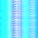

## Quantum Image Encryption Algorithm 

The goal of this project is to generate an image encryption algorithm that
efficiently and effectively encodes digital image information in a secure way. 

The current novel quantum-digital-image representation is known as the "Novel
Enhanced Quantum Representation
([NEQR](https://link.springer.com/article/10.1007/s11128-013-0567-z_)) of digital images which uses the basis state of a qubit sequence to store the gray-scale value of each pixel in the image. There are a few other methods as well, but they are all incredibly similar and only have distinctions in how they prepare the qubits.

NEQR's qubit requirement is very large however, requiring $n^2 + q-1$ qubits, for an $n \times n$ image, where $2^q$ is the number of gray-scale values of the image. Moreover, color mappings outside of
NEQR's digital image representation are required to encrypt color images. 

This project aims to generate a quantum algorithm that, for now, requires only

$$\left( \frac{n^2}{2^m} \right) \times (m-1)$$ 

qubits to fully encrypt a color image, where $m$ is some integer. In the future I will attempt
to reduce the qubit requirement based on the receiver's demand for
image-quality.

I will provide specifics once the research paper is pending publication. Here
are some preliminary results though: 

#### Original Image

#### Encrypted Image 

Encrypting this 64x64 (4096px) image took 149.5 seconds -- quite slow. However,
the qubit requirement was only 119 (against NEQR's 4164 qubit requirement).
This is a vast improvement and the algorithm efficiency will only get faster.

