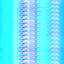
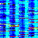
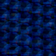
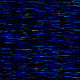
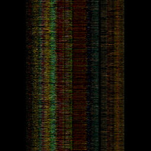

## Quantum Image Encryption Algorithm

The goal of this project is to generate an image encryption algorithm that efficiently and effectively encodes digital image information in a secure way.

The current novel quantum-digital-image representation is known as the "Novel Enhanced Quantum Representation" ([NEQR](https://link.springer.com/article/10.1007/s11128-013-0567-z_)) of digital images, which uses the basis state of a qubit sequence to store the gray-scale value of each pixel in the image. There are a few other methods as well, but they are all incredibly similar and only have distinctions in how they prepare the qubits.

This project aims to generate a quantum algorithm that, for now, requires 

$$\left( \frac{n^2}{2^m} + 1 \right) \times (m-1)$$ 

qubits to fully encrypt a color image, where $m$ is some integer such that $2^m$ is less than half the $n \times n$ of pixels. In the future, I will attempt to reduce the qubit requirement based on the receiver's demand for image quality.

This qubit requirement is quite large, however, the preparation time requirement to generate the quantum wave function that describes the image is less.

Perhaps when quantum computers become advanced enough such that the qubit requirement is not an issue will this project have some benefit. For now, it is just a new way to imagine encoding information using hyperspheres and multi-dimensional wave functions.

I do have interesting ideas to incorporate NEQR with the hypersphere idea to potentially reduce the qubit requirement even further than NEQR, but that will be in the future.

---

The Algorithm roughly performs the following sequence of steps:

- Extract the pixel information from an image and convert $2^n$ pixels (top left to bottom right) reversibly into an $n$-dimensional statevector.
- Generate a $2^n$ dimensional hypersphere, where each $2^n$ dimensional unit vector points to a set of $2^n$ pixel's $(R,G,B)$ information.
- Group sequences of $n$-dimensional statevectors; run them all through randomized gates of large depth and afterwards generate mixed state density matrix as a linear combination of the resulting statevectors post-circuit within each original sequence.
  - I use IBM's statevector simulator backend as there exists no real backend to handle this project's qubit requirement.
  - I generate the coefficients in the linear combination by calculating the fidelity (matrix "distance" in the $2^n$ dimensional hilbert space) with a randomly generated density matrix.
- Spectral decomposition is then performed on the resulting mixed density matrices to extract possible pure state eigenvectors along with their corresponding probability eigenvalues.
- The Von Neumann Entropy of each mixed density matrix is calculated based on the probability eigenvalues of each matrix.
- The mixed density matrix eigenvectors order is altered based on decreasing entropy.
- I convert all the eigenvectors back into $2^n$ dimensional unit-vectors and extract their corresponding RGB information.
- Generate the encrypted image using the RGB information.

This whole process is reversible. Here's some examples:

#### Original Image

#### Encrypted Image w/ 119 qubits

#### Decrypted Image

Encrypting this 64x64 (4096px) image took 149.5 seconds -- quite slow. The corresponding qubit requirement is 119.

In addition, if you re-run the encryption algorithm, the outputted image changes, *while also still* storing the information of the original image, along with a private key and a $2^n$ dimensional hypersphere. Again, I will provide specifics later.

---

If I increase the allowed qubit requirement to 771 qubits, the image gets encrypted in just 9.2 seconds:

#### Encrypted Image w/ 771 qubits

Here's some more examples:

80x80

182 qubits, 230.5s -- some interesting patterns emerge.

505 qubits, 12.5s

#### Decrypted Image

---

## Final Boss - 256 x 256 image

Initial Image:

#### Encrypted Image

Took 3900 seconds to encrypt using 1799 qubits.

#### Decrypted Image

Took 3670 seconds.

Original 256x256 Image Size: 5KB

Encrypted 256x256 Image Size: 87KB

Thanks for checking this project out!

---